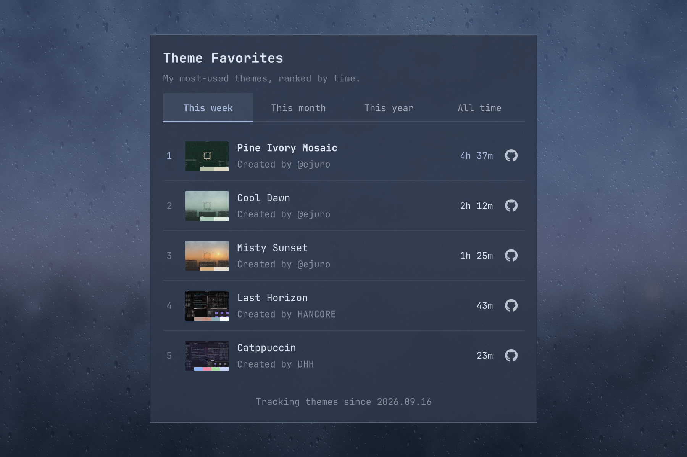

# Theme Favorites

Find your favorite Omarchy themes through actual use. Switch between **This week,
This month, This year, and All time**, with five rows visible and your top 20
available by scrolling. Each theme includes a preview, creator credit, usage time,
and a GitHub link.



## Install

Requires Omarchy with the Quickshell plugin system, Python 3.11+, and Hyprland
with the monitor lock-state information used by Omarchy.

```sh
omarchy plugin add https://github.com/ejuro/omarchy-theme-favorites.git --enable
```

Follow Omarchy’s prompts to add the plugin and choose its bar position, then
open the palette icon. Omarchy manages the installed copy in your plugins folder.

To update:

```sh
omarchy plugin update io.github.ejuro.theme-favorites
```

## How it works

Themes rank by estimated unlocked desktop time; unlocked idle time counts.
Locked, suspended, display-off, and disabled periods are excluded when detected.
Tracking samples every five seconds. Weeks start on Monday in your local timezone.

Hover a theme for its selection count, full usage time, and original palette
credit. Main credits identify the Omarchy theme creator; see [attribution notes](docs/ATTRIBUTION.md).
Use Left/Right or Tab to change periods, Up/Down to select a row, and Enter to
open its repository. Escape closes the panel.

All history stays on your machine, with no telemetry. It survives restarts and
updates, including themes outside the top 20. Data is stored in
`~/.local/state/theme-favorites/` (or `$XDG_STATE_HOME/theme-favorites`).

## Share your favorites

Click the share icon for a compact preview of your selected period’s top five on the active
wallpaper. Choose **Export image** to save a 1800 × 1200 PNG under
Pictures → Theme Favorites, then upload it to X or anywhere else.

## Disable or remove

```sh
omarchy plugin disable io.github.ejuro.theme-favorites
```

To uninstall:

```sh
omarchy plugin remove io.github.ejuro.theme-favorites
```

History is preserved. Remove the history directory separately only if you want
to erase your statistics.

MIT licensed. Initial release; requires the current Omarchy shell plugin system.
